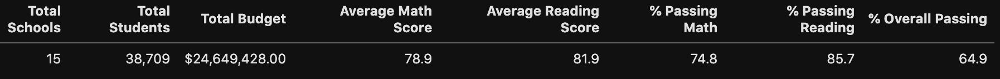
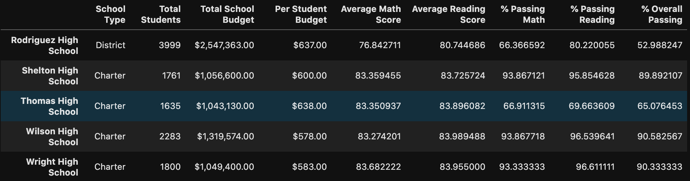
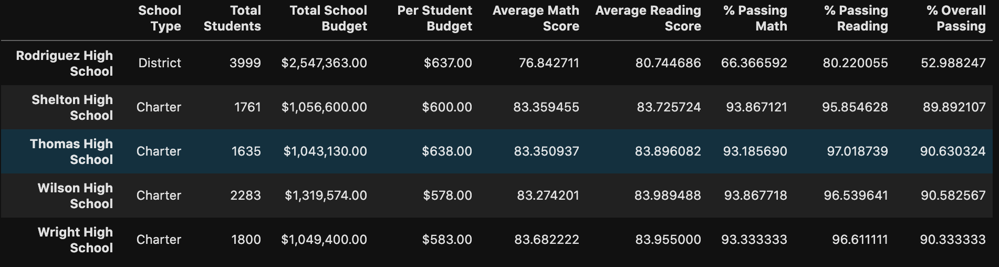
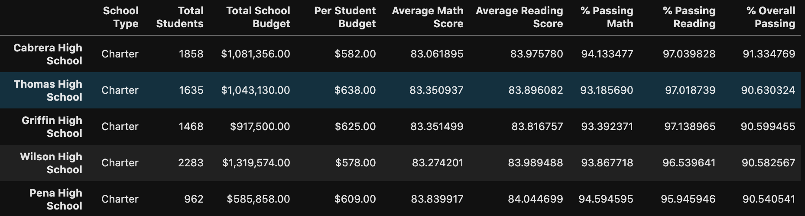
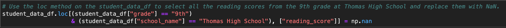
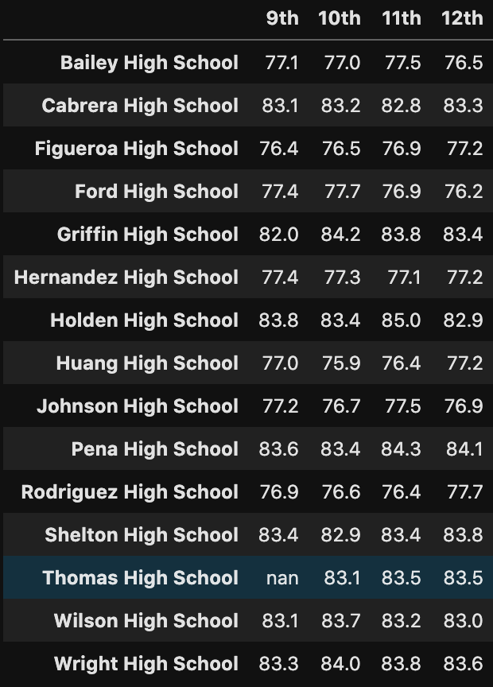
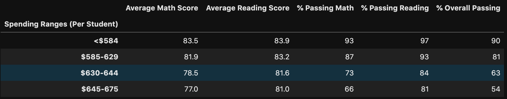
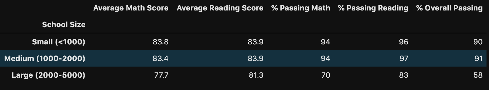

# School District Analysis

## Overview of Project

### Background and Purpose

The school board notified your supervisor, Maria that the 'students_complete.csv' file shows evidence of academic dishonestly with the reading and math grades for ninth graders at Thomas High School. Although the school board doesn't know the extent of the academic dishonesty, they want to uphold state-testing standards and have turned to Marie for help. She has requested that the math and reading scores for grade nine be replaced with 'NaNs' while keeping the rest of the data intact. Once replaced, the analysis is to be repeated and then describe how these changes affected the overall analysis.

The purpose of the report is to compare and show the results of the requested task of replacing grade nine test scores at Thomas High School with 'NaNs' and observing and changes that might occur in the new analysis. We will look at the following results in the upcoming section:

- How is the district summary affected?

- How is the school summary affected?

- How does replacing the ninth grader's math scores affect the following:

    - Math and reading scores by grade
    - Scores by school spending
    - Scores by school size
    - Scores by school type

## Results

The **district summary** didn't seem to change much in terms of the values. The student count was 461 students less after subtracting the ninth graders from Thomas High School from the total but the math and reading averages and percentages seemed to stay the same. The result I would have expected was for them to go up considering the school's average went up after eliminating the ninth graders. I suppose 461 students didn't have a very big impact when averaged with the rest of the schools.

The **school summary** was affected in a more obvious way after calculating the new percentages based on grade 10 through 12 and replacing the values in the summary data-frame. The images bellow show a before and after and you can clearly see that the results of the grade nine math and reading test scores dramatically pulled down the school's passing percentages.

**Before Removing Grade 9:**

**After Removing Grade 9:**

As you can see by comparing the two images, the passing percentages were in the 60s range and after the removal in the 90s. This is a considerable difference and shows that either the grade nines at this school did poorly in their math and english scores or that some kind of tampering of scores took place to bring them down.

Replacing the ninth grader's math and reading scores moved Thomas High School from the bottom five of schools in overall percentage into the top five overall performance. This clearly shows that the grade nine averages had a negative impact on the overall scores of the school.

**Top Five Scores (after removing grade nine):**

The only way that I could see that the Math and Reading scores were affected by grade was in the grade nine column, and in the Thomas High School row where a 'nan' was replaced by the code we wrote replacing all THS ninth grade scores.

**Code Example**

As you see in the below image, the Thomas High School ninth grade score was replaced with a NaN.

The **scores by school spending** were affected by the change as the range of $630 - $644 per student where Thomas High School falls into would have got a bit of a boost from the higher test score averages when calculating the new averages.

**Scores by School Spending**

The **scores by school size** was also affected by the change as the lower scores in grade nine were no longer pulling the averages down and showed in a boost in passing percentages. The image below shows the **Medium(1000-2000)** school size with boosted numbers which is where Thomas High School falls in with over 1600 students.

**Scores by School Size**

The **scores by school type** were affected in the same way the above was for the same reason. Maybe not as dramatic as the Charter schools already had higher test scores than the District schools, yet the lower grade nine scores and overall averages would certainly have some kind of impact on the overall scores for Charter schools.

**Scores by School Type**

## Summary

The **four major changes** that occurred to the School District Analysis after the Thomas High School ninth grader's math and reading scores were replaced was that the School Summary changed dramatically pushing the school into the top five of overall scores. The **Scores by School Spending, Size and Type** were all affected with a positive up-tick in scores due to the compromised grade nine scores. This possibly allowed for a more accurate depiction of the overall results from the high school although not as accurate if the score themselves wouldn't have been tampered with and could have been included.

### Links

[Py City Schools Main Code](PyCitySchools_Challenge.ipynb)
